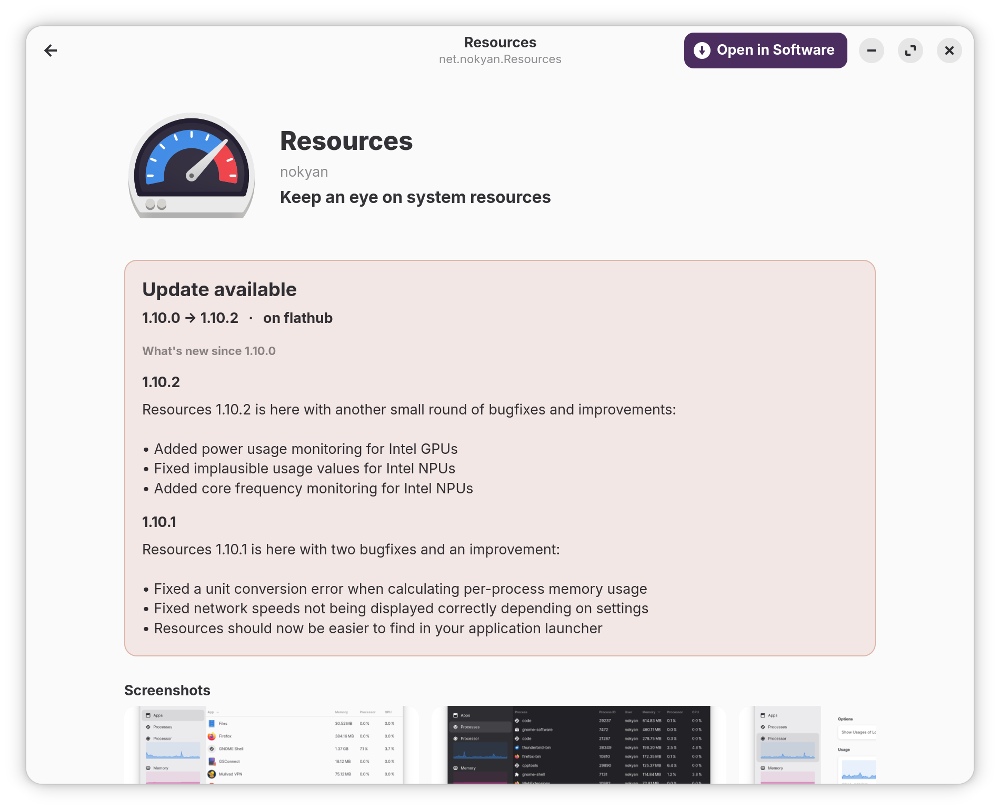

<div align="center">


# Flatpal

A GTK4 overview of your Flatpak apps: what's installed, what's running, and
what's on Flathub. Doesn't replace `flatpak` or GNOME Software; it's a
read-only viewer that hands off install/uninstall actions to whichever
software centre you already use.

*Released under [GPL-3.0-or-later](LICENSE).*

</div>

## Install

```sh
flatpak install --user https://hawwwran.github.io/hwnhub/io.github.hawwwran.flatpal.flatpakref
```

Pulls Flatpal from **hwnhub**, a small self-hosted Flatpak channel, and
adds the remote in one step. Runtimes come from Flathub. After install,
launch from your activities overview or run `flatpal` in a terminal.

## What you get

### Running

<p align="center">
  
</p>

Every running Flatpak sandbox with its CPU and memory, sampled every
two seconds (1, 2, 5, 10 or 30 s picker; the next sample only fires
while the tab is visible). The status line on the left totals CPU and
memory across all running apps.

Apps with more than one sandbox expand into a per-instance breakdown:
each sub-row shows its PID, command line, time since start, and per-
instance CPU / memory share, so a multi-window Inkscape session tells
you which window is doing the work. Sort by CPU (default), memory, or
name. **Freeze position** pins the current order while the numbers
keep updating; **Collapse all** appears whenever any expander is open.

### Installed

<p align="center">
  
</p>

Every installed Flatpak app with its icon, version, on-disk size, and
install date. Type anywhere in the window to filter by name, app ID,
developer, or summary — the search box stays focused. Sort by name,
install date (newest first by default), or size. Apps whose remote has
a newer version get a terracotta **Update available** pill; the same
pill appears on the Running and Explore tabs.

### Explore

<p align="center">
  
</p>

Search Flathub's ~4 000-app catalogue from your local AppStream cache
(no network for the search itself). Default sort is most popular by
installs in the past month; the popularity data is fetched in four
parallel pages from Flathub's collection API and cached for 24 h.
Installed apps show an "Installed" badge.

With the search box empty, a **Popular on Flathub** shelf lists the top
apps. Lists start at 50 entries with a *Show more* button that extends
50 at a time, up to the full top-1000. The **Show popular** switch
hides the empty-state shelf when you'd rather see a plain "Type to
search" placeholder; the popularity sort and the per-row install-count
chips keep working either way.

## The detail page

<p align="center">
  
  &nbsp;
  
</p>

Click any app (installed or not) for a detail view with the summary,
screenshots, full description, license, homepage, donate / help /
issue-tracker links, and (for installed apps) a sandbox-permissions
summary plus version, size, and install date. Catalog-only apps use
the same layout minus the install-specific fields.

<p align="center">
  
</p>

If the app has a pending update, a tinted **Update available** card
slots in under the hero with the version diff
(`{current} → {new} · on {origin}`) and inline release notes for every
version between the installed one and the remote. Notes come from the
Flathub catalog's release list, not the local metainfo, so versions
newer than what's installed are visible.

Click a screenshot to open it borderless-fullscreen on the same monitor
as the Flatpal window. Arrow keys navigate the gallery; Escape or `q`
closes.

Two header buttons:

- **Open app**: runs the installed flatpak (installed apps only).
- **Open in Software**: hands off to GNOME Software for install,
  uninstall, or update.

## Install from source

```sh
./install.sh
```

For development or out-of-channel builds. Drops these into `~/.local`:

| Where                                                                     | What                              |
| ------------------------------------------------------------------------- | --------------------------------- |
| `~/.local/bin/flatpal`                                                    | Launcher on `PATH`                |
| `~/.local/share/flatpal/flatpal/`                                         | The Python package                |
| `~/.local/share/applications/io.github.hawwwran.flatpal.desktop`          | Desktop entry (visible in launcher) |
| `~/.local/share/icons/hicolor/{16,24,32,48,64,96,128,192,256,512}x*/apps/io.github.hawwwran.flatpal.png` | Crisp icons at every native size, named to match the running window's `app_id` so the taskbar finds them |

After install, launch from a terminal (`flatpal`) or search "Flatpal" in
the GNOME / Zorin activities overview.

### Open straight to a single app

```sh
flatpal --detail=org.signal.Signal
```

Opens directly on that app's detail page; useful when wiring Flatpal
into another tool's "more info" action.

### Uninstall

```sh
./uninstall.sh
```

Removes every file the installer placed and refreshes the desktop /
icon caches. The screenshot cache at `~/.cache/flatpal/screenshots/`
and the Flathub popularity cache at
`~/.cache/flatpal/flathub-popular.json` are left in place; delete them
manually to reclaim the disk space.

## Requirements

System packages already present on most modern GNOME desktops (Zorin OS 18,
Ubuntu 24.04, Fedora 40+):

- `python3-gi`, `gir1.2-gtk-4.0`, `gir1.2-adw-1` (libadwaita ≥ 1.4, tested
  against 1.5)
- `python3-psutil` (Running tab CPU/memory sampling)
- `flatpak`
- `gnome-software` (only used by "Open in Software")

No third-party Python packages. Everything is stdlib + GObject Introspection.

---

## Under the hood

### Project layout

```
flatpal/                Python package
  app.py                Main window, ViewSwitcher, tab routing
  installed_page.py     Installed tab
  running_page.py       Running tab UI (expander rows, freeze toggle, refresh dropdown)
  running.py            `flatpak ps` parser + psutil-based stats tracker (pure)
  explore_page.py       Explore tab: search, popular shelf, Show more
  detail.py             Per-app detail page (Adw.NavigationPage)
  screenshot_viewer.py  Borderless fullscreen gallery
  navigator.py          Wraparound image navigator (pure)
  catalog.py            Flathub appstream.xml.gz streaming loader (pure)
  metainfo.py           AppStream metainfo XML parser + locale picker (pure)
  permissions.py        `flatpak info -m` parser + summariser (pure)
  popularity.py         Flathub /collection/popular fetcher + cache (pure)
  updates.py            `flatpak remote-ls --updates` parser + release-diff (pure)
  cache.py              Screenshot on-disk cache + downloader
  search.py             Search/filter helpers (pure)
  core.py               flatpak list / history parsing, sort (pure)
  settings.py           JSON-on-disk preferences (last tab, sort orders, …) (pure)
  widgets.py            Shared small widgets (sort pill, freeze pill, update pill, …)
  palette.py            Brand palette constants, shared with tools/preview_flathub.py (pure)
  host.py               `flatpak-spawn --host` wrapper for sandboxed subprocess calls (pure)
  debuglog.py           Opt-in file logger gated on FLATPAL_DEBUG=1
  constants.py          Tuning knobs in one place
data/                   .desktop file, pre-sized PNG icons, screenshots
install.sh              User-local installer
uninstall.sh            Removes everything
```

The `(pure)`-tagged modules import zero GTK and have no side effects
at import time, so they can be reused from another Python project.

### Where data comes from

| Field                      | Source                                                                              |
| -------------------------- | ----------------------------------------------------------------------------------- |
| Running apps               | `flatpak ps --columns=instance,pid,child-pid,application,branch`; one row per       |
|                            | sandbox. CPU and memory read via `psutil.Process(pid)` walked recursively over each |
|                            | instance's process tree. CPU % is delta-based (first sample = baseline = 0 %).      |
| Per-sandbox cmdline / age  | `/proc/<pid>/cmdline` and `create_time` via `psutil`, queried on the root PID of    |
|                            | each instance so children don't duplicate the line.                                 |
| App list, version, size    | `flatpak list --app --columns=…`                                                    |
| Install date               | First `deploy install` entry in `flatpak history` (with `LC_ALL=C` for month names) |
| Icon                       | System icon theme (Flatpak exports its app icons into `hicolor/`)                   |
| Summary, description,      | AppStream metainfo at                                                               |
| screenshots, URLs,         | `/var/lib/flatpak/app/<id>/current/active/files/share/metainfo/<id>.metainfo.xml`   |
| developer, license, …      | (system) or `~/.local/share/flatpak/app/<id>/…` (user). Localised variants via      |
|                            | `xml:lang` are honoured.                                                            |
| Screenshots (image data)   | External URLs from the metainfo (Flathub GitHub raw, project sites). Downloaded     |
|                            | once to `~/.cache/flatpal/screenshots/<id>/<sha>.png` and reused. Content-Type      |
|                            | must be `image/*` and bodies ≤ 10 MB.                                               |
| Sandbox permissions        | `flatpak info -m <id>`; `[Context]` section: `shared`, `sockets`, `devices`,        |
|                            | `filesystems`, `features`; plus D-Bus surface counts.                               |
| Explore catalog            | `/var/lib/flatpak/appstream/flathub/<arch>/active/appstream.xml.gz`,                |
|                            | ≈4 000 components, streamed via `ET.iterparse` so peak memory stays bounded.        |
|                            | Falls back to the user-install path at `~/.local/share/flatpak/...` when system     |
|                            | doesn't have the Flathub remote configured.                                         |
| Explore icons              | Pre-rendered PNGs in the same dir at `.../icons/{128x128,64x64}/<id>.png`.          |
| Explore popularity         | `https://flathub.org/api/v2/collection/popular`; top-1000 apps by installs in the   |
|                            | past month, fetched as 4 parallel `?page=N&per_page=250` calls. Cached for 24 h;    |
|                            | partial fetches are returned to the UI but **not** persisted, so the next launch    |
|                            | retries.                                                                            |
| Available updates          | `flatpak remote-ls --updates --app`; one ~2.5 s background call at window startup   |
|                            | feeds an in-memory `{app_id: {version, branch, origin, commit}}` dict that every    |
|                            | tab consults for the "Update available" pill. Flat cost regardless of install       |
|                            | count; lookup is a dict-get per row.                                                |
| Release notes (newer)      | Flathub aggregated catalog's `<release>` entries; locally-installed metainfo only   |
|                            | lists releases up to the deployed version, so the "What's new since 1.10.0" diff    |
|                            | reads from the catalog instead. Window pre-loads the catalog at startup so detail   |
|                            | pages of updateable apps see it.                                                    |

### Brand & licensing

The name "Flatpal" and the squircle icon belong to this project.
Flatpak, Flathub, GNOME, libadwaita, and the apps Flatpal lists belong
to their respective owners.

Released under the GNU General Public License v3.0 or later (SPDX:
`GPL-3.0-or-later`). See [`LICENSE`](LICENSE) for the full text.
