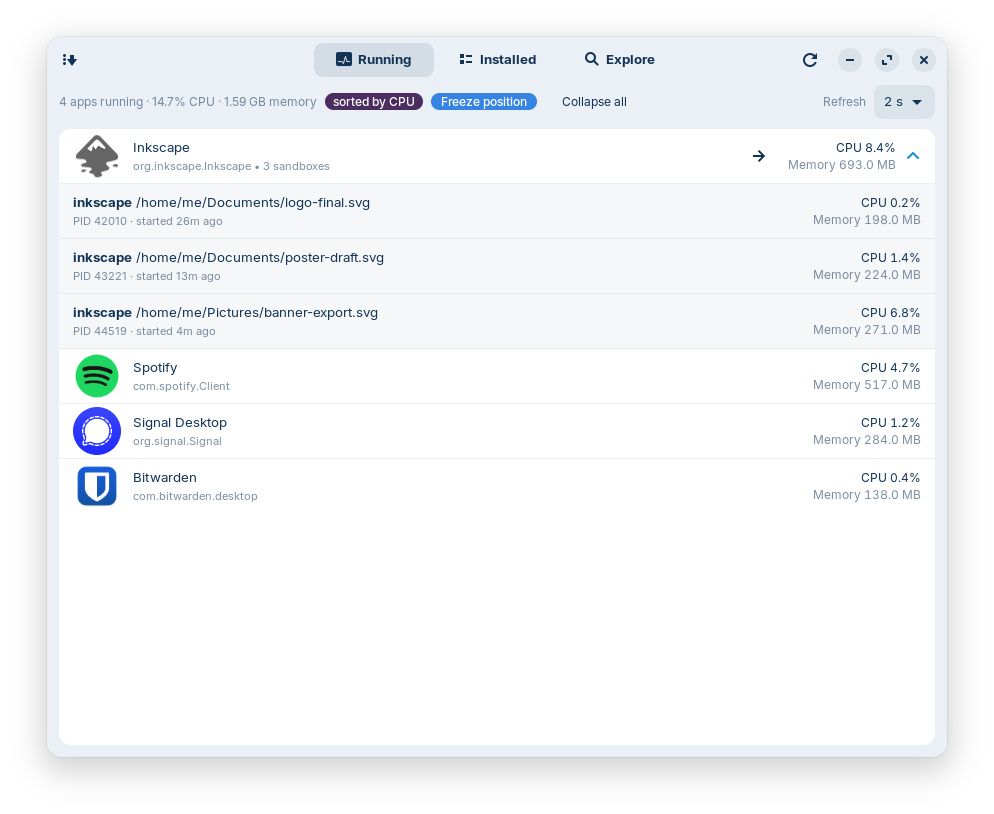
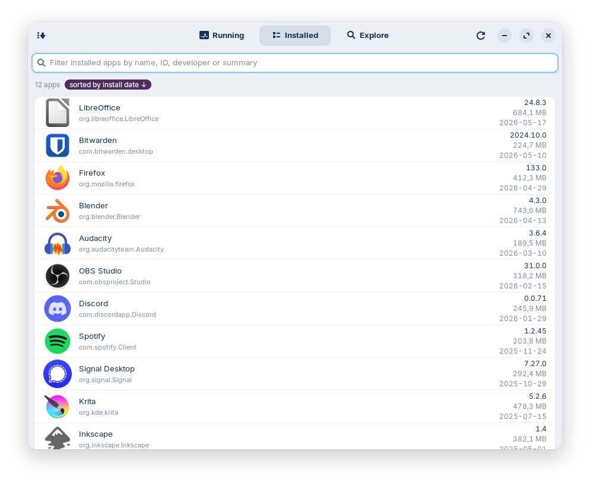
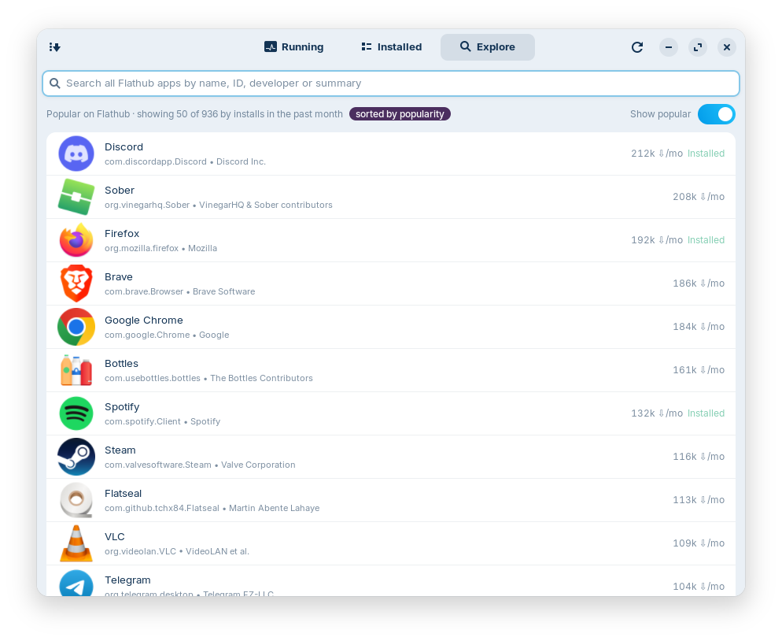
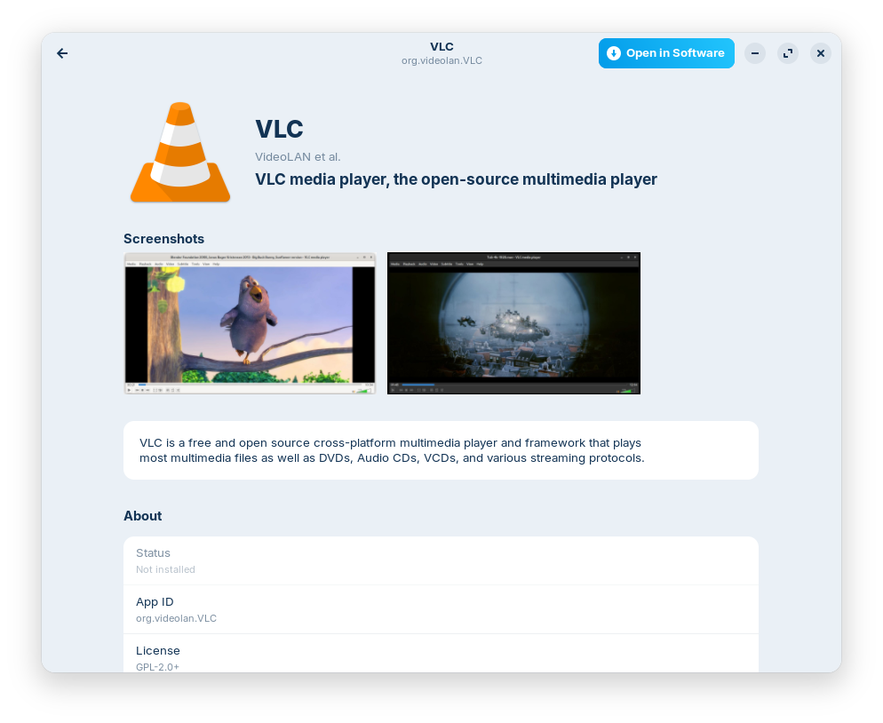

<div align="center">


# Flatpal

**Your friendly Flatpak overview companion.**

*Released under [GPL-3.0-or-later](LICENSE).*

</div>

Flatpal sits next to the Flatpak apps on your machine and gives you a clear,
calm picture of what's there: what's installed, what's running right now, and
what's worth a look on Flathub. It doesn't replace `flatpak`, GNOME Software,
or any other tool — it just makes it easier to *see* your flatpaks at a
glance, and to dig into one when you're curious.

Think of it as a well-organised drawer for the apps you already chose.

## What you get

Three tabs, one window, lots of helpful context.

### Running

<p align="center">
  
</p>

A live look at every Flatpak sandbox currently running on your system,
with **CPU and memory** refreshed every two seconds (pick 1, 2, 5, 10
or 30 s from the inline dropdown — the next sample only fires while the
tab is visible). The status line on the left rolls up the total CPU and
memory across all running apps.

Apps with more than one sandbox expand into a per-instance breakdown:
each sub-row shows its **PID, command line, time since start** and its
own CPU / memory share — so you can tell which open Inkscape window is
actually doing the work. Sort by CPU (default — heaviest hitters on top),
memory, or name. Toggle **Freeze position** to pin the current order
while sampling swings keep updating the numbers, and **Collapse all**
appears whenever any expander is open.

### Installed

<p align="center">
  
</p>

Every app deployed on the machine, each with its icon, version, on-disk
size and the date you first installed it. Start typing anywhere in the
window to filter by name, app ID, developer or summary — the search box
is always focused, you never have to click into it. Sort by name, install
date (newest first by default), or size.

### Explore

<p align="center">
  
</p>

Browse Flathub's catalogue without leaving the window. Search by name,
ID, developer or summary across ~4 000 apps using your local AppStream
cache (no extra network for the search itself). Default sort is **most
popular** by installs in the past month — the data comes from Flathub's
collection API, fetched in four parallel pages and cached for 24 h. Apps
you already have wear a small "Installed" badge.

Empty search shows a **"Popular on Flathub"** shelf — the top apps right
now, ready to click. Lists start at 50 entries with a *Show more* button
that extends 50 at a time, up to the full top-1000. Don't want the
network calls? Flip the **Show popular** switch off and Explore stays
fully offline (local AppStream search still works).

## The detail page

<p align="center">
  
  &nbsp;
  
</p>

Click any app — installed or not — to slide into a detail view with the
summary, screenshots, full description, license, homepage, donate / help /
issue-tracker links, and (for installed apps) a compact sandbox-permissions
summary plus version, size and install date. Catalog-only apps land on
the same page minus the install-specific fields — same layout, less
clutter.

Click a screenshot to open it **borderless fullscreen** on the same
monitor as the Flatpal window, with arrow-key navigation through the
gallery and Escape / `q` to close.

Two action buttons in the header:

- **Open app** — runs the installed flatpak (shown only when it's installed).
- **Open in Software** — hands off to GNOME Software when you want to
  install, uninstall or update.

Flatpal is happy to be the place you *look*; it lets your distro's software
centre be the place you *act*.

## Install (user-local, fully reversible)

```sh
./install.sh
```

Drops six things into `~/.local`:

| Where                                                                     | What                              |
| ------------------------------------------------------------------------- | --------------------------------- |
| `~/.local/bin/flatpal`                                                    | Launcher on `PATH`                |
| `~/.local/share/flatpal/flatpal/`                                         | The Python package                |
| `~/.local/share/applications/io.github.hawwwran.flatpal.desktop`          | Desktop entry (visible in launcher) |
| `~/.local/share/icons/hicolor/{16,24,32,48,64,96,128,192,256,512}x*/apps/io.github.hawwwran.flatpal.png` | Crisp icons at every native size, named to match the running window's `app_id` so the taskbar finds them |

After install, launch from a terminal (`flatpal`) or search "Flatpal" in
the GNOME / Zorin activities overview.

### Open straight to a single app

```sh
flatpal --detail=org.signal.Signal
```

Window opens directly on that app's detail page — handy if you're wiring
Flatpal into another tool's "more info" action.

### Uninstall

```sh
./uninstall.sh
```

Removes every file the installer placed and refreshes the desktop / icon
caches. The screenshot cache at `~/.cache/flatpal/screenshots/` and the
Flathub popularity cache at `~/.cache/flatpal/flathub-popular.json` are
left alone (they're cheap to rebuild — delete them yourself if you'd like
the disk space back).

## Requirements

System packages already present on most modern GNOME desktops (Zorin OS 18,
Ubuntu 24.04, Fedora 40+):

- `python3-gi`, `gir1.2-gtk-4.0`, `gir1.2-adw-1` (libadwaita ≥ 1.4 — tested
  against 1.5)
- `python3-psutil` (Running tab CPU/memory sampling)
- `flatpak` (obviously)
- `gnome-software` (only used for the "Open in Software" hand-off)

No third-party Python packages. Everything is stdlib + GObject Introspection.

---

## Under the hood

### Project layout

```
flatpal/                Python package
  app.py                Main window, ViewSwitcher, tab routing
  installed_page.py     Installed tab
  running_page.py       Running tab UI (expander rows, freeze toggle, refresh dropdown)
  running.py            `flatpak ps` parser + psutil-based stats tracker (pure)
  explore_page.py       Explore tab — search, popular shelf, Show more
  detail.py             Per-app detail page (Adw.NavigationPage)
  screenshot_viewer.py  Borderless fullscreen gallery
  navigator.py          Wraparound image navigator (pure)
  catalog.py            Flathub appstream.xml.gz streaming loader (pure)
  metainfo.py           AppStream metainfo XML parser (pure)
  permissions.py        `flatpak info -m` parser + summariser (pure)
  popularity.py         Flathub /collection/popular fetcher + cache (pure)
  cache.py              Screenshot on-disk cache + downloader
  search.py             Search/filter helpers (pure)
  core.py               flatpak list / history parsing, sort (pure)
  settings.py           JSON-on-disk preferences (last tab, sort orders, …) (pure)
  widgets.py            Shared small widgets (sort pill, freeze pill, …)
  constants.py          Tuning knobs in one place
data/                   .desktop file, pre-sized PNG icons, screenshots
install.sh              User-local installer
uninstall.sh            Removes everything
```

The `(pure)`-tagged modules import zero GTK and have no side effects at
import time — handy if you want to reuse a parser from another Python
project.

### Where data comes from

| Field                      | Source                                                                              |
| -------------------------- | ----------------------------------------------------------------------------------- |
| Running apps               | `flatpak ps --columns=instance,pid,child-pid,application,branch` — one row per      |
|                            | sandbox. CPU and memory read via `psutil.Process(pid)` walked recursively over each |
|                            | instance's process tree. CPU % is delta-based (first sample = baseline = 0 %).      |
| Per-sandbox cmdline / age  | `/proc/<pid>/cmdline` and `create_time` via `psutil`, queried on the root PID of    |
|                            | each instance so children don't duplicate the line.                                 |
| App list, version, size    | `flatpak list --app --columns=…`                                                    |
| Install date               | First `deploy install` entry in `flatpak history` (with `LC_ALL=C` for month names) |
| Icon                       | System icon theme (Flatpak exports its app icons into `hicolor/`)                   |
| Summary, description,      | AppStream metainfo at                                                               |
| screenshots, URLs,         | `/var/lib/flatpak/app/<id>/current/active/files/share/metainfo/<id>.metainfo.xml`   |
| developer, license, …      | (system) or `~/.local/share/flatpak/app/<id>/…` (user). Localised variants via      |
|                            | `xml:lang` are honoured.                                                            |
| Screenshots (image data)   | External URLs from the metainfo (Flathub GitHub raw, project sites). Downloaded     |
|                            | once to `~/.cache/flatpal/screenshots/<id>/<sha>.png` and reused. Content-Type      |
|                            | must be `image/*` and bodies ≤ 10 MB.                                               |
| Sandbox permissions        | `flatpak info -m <id>` — `[Context]` section: `shared`, `sockets`, `devices`,       |
|                            | `filesystems`, `features`; plus D-Bus surface counts.                               |
| Explore catalog            | `/var/lib/flatpak/appstream/flathub/<arch>/active/appstream.xml.gz` —               |
|                            | ≈4 000 components, streamed via `ET.iterparse` so peak memory stays bounded.        |
|                            | Falls back to the user-install path at `~/.local/share/flatpak/...` when system     |
|                            | doesn't have the Flathub remote configured.                                         |
| Explore icons              | Pre-rendered PNGs in the same dir at `.../icons/{128x128,64x64}/<id>.png`.          |
| Explore popularity         | `https://flathub.org/api/v2/collection/popular` — top-1000 apps by installs in the  |
|                            | past month, fetched as 4 parallel `?page=N&per_page=250` calls. Cached for 24 h;    |
|                            | partial fetches are returned to the UI but **not** persisted, so the next launch    |
|                            | retries.                                                                            |

### Brand & licensing

Flatpal is a small personal-scale tool. The name "Flatpal" and the squircle
icon are this project's; the rest of the world (Flatpak, Flathub, GNOME,
libadwaita, the apps it lists) belongs to their respective owners.

Flatpal itself is released under the **GNU General Public License v3.0 or
later** (SPDX: `GPL-3.0-or-later`). See [`LICENSE`](LICENSE) for the full text.
